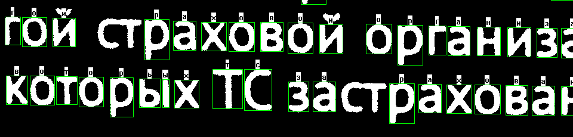

# Lab_TextRec

Лабораторная работа по распознаванию печатного текста.
## Введение. Цель проекта.
Этот простой демонстрационный проект предназначен для обучения и постижения основ обработки изображений и простейшей логистической регресиии. С помощью этого проекта вы можете познакомиться с такими основными элементами технологии распознавания образов, как выделение характерных особенностей (image features) и построение классификатора.
*Рыночная ниша проекта.*
Это простой демонстрационный проект, созданный в целях обучения. Он никаким образом не является конкурирующим с комерческими системамми распознавания текстов и других образов. Предназначение проекта - заглянуть "под капот" и понять, как работает распознавание шаг за шагом.

## Сравнение с аналогами
Продукт | Стоимость | Русские символы | Латинские символы | Цифры | Учет регистра
--------|-----------|-----------------|-------------------|-------|--------------
Abby Fine Reader|$$$|+|+|+|+
OCR Cunei form|$$$|+|+|+|+
Lab_TextRec|бесплатно|+|-|-|-

## Требования к аппаратуре
Настольный компьютер, процессор не хуже Intel Core i7, оперативная память не менее чем 4 Гб.
Графическая видео-карта не хуже NVidia GForce GTX 780Ti

## Характеристики продукта
*Расход памяти:* 
максимальный расход требуемой памяти равен примерно 4 000 000 000 байт и миожет быть вычислен как XX * YY * ZZ, где XX - размер изображения в пикселях по горизонтали , YY - размер изображения в пикселях по вертикали, ZZ - коэффициент, равный 24 (используется 6 промежуточных изображений, формат пикселя - 4 байта, ARGB)
*Производительность:*
Приложение работает со скоростью не ниже чем 30 кадров в секунду для входного изображения размером 1024*600 пикселей.
*Надежность:*
Приложение обеспечивает примерно 95% точности распознавания текста. Эти результаты получены на синтетических тестах, прилагаемых к приложению.

## Формат входных данных
Приложение принимает на вход графические файлы в формате JPEG. Более подробно о формате JPEG прочитать [тут](https://www.w3.org/Graphics/JPEG/jfif3.pdf)

## Формат выходных данных
Выходными данными являются текстовые файлы в формате XML, тэги котороо имеют следующий смысл:

## Описание интерфейса пользователя
Приложение поставляется с простейшим интерфейсом командной строки. Формат запуска приложения:
app.exe FileName, где FileName - имя файла с изображением, которое требуется распознать

## Описание API библиотеки
Приложение представляет собой законченное standalone приложение и не предполагает наличия внешнего интерфейса (это не библиотека). Тем не менее, внутренняя реализация основывается на методе Predictor::performPrediction, в котором используются следующие аргументы:
* Raster* Входной изображение (в растеризованной форме)
* Model* (Модель предсказания, обученная заранее)
* RectSet& (Выходной набор прямоугольников с 2d координатами и распознанным символом)

## Тестирование. Классы тестов
Для тестирования используется набор специальных изображений, для которых уже сделана "разметка" символов вручную.

## Ссылки и литература
1. P.Frey, D.Slate, "Letter Recognition Using Holland-Style Adaptive Classifiers", Machine Learning, 1991. [PDF](https://ai2-s2-pdfs.s3.amazonaws.com/b421/fa2ce87913a88002e7a8f917afcd3733b8b4.pdf)
2. Y.Chung, M.Wong, "Handwritten Character Recognition By Fourier Descriptors and Neural Network", IEEE, 1997. [PDF](http://ieeexplore.ieee.org/stamp/stamp.jsp?arnumber=647338)
